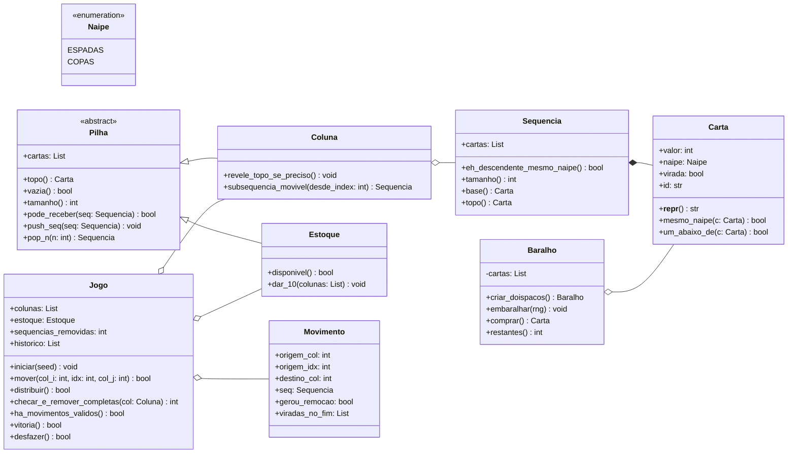
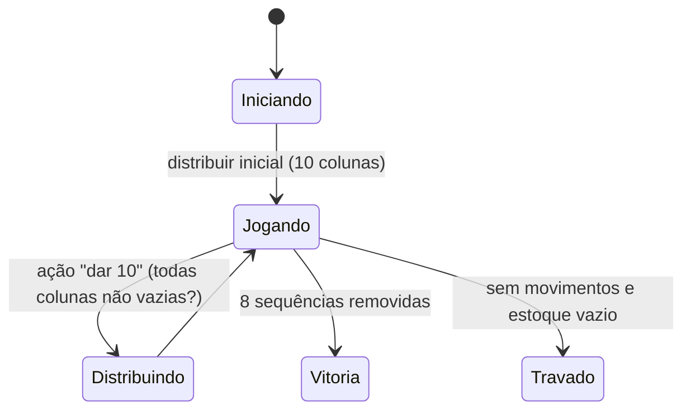
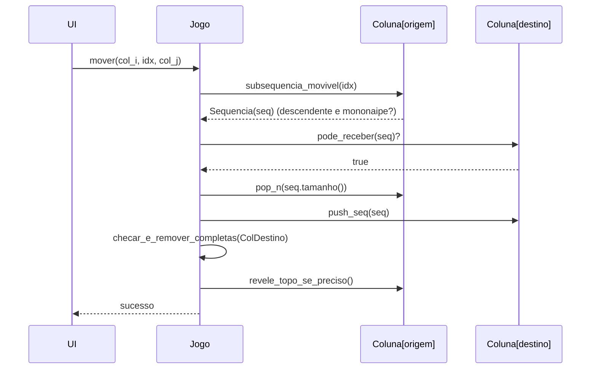
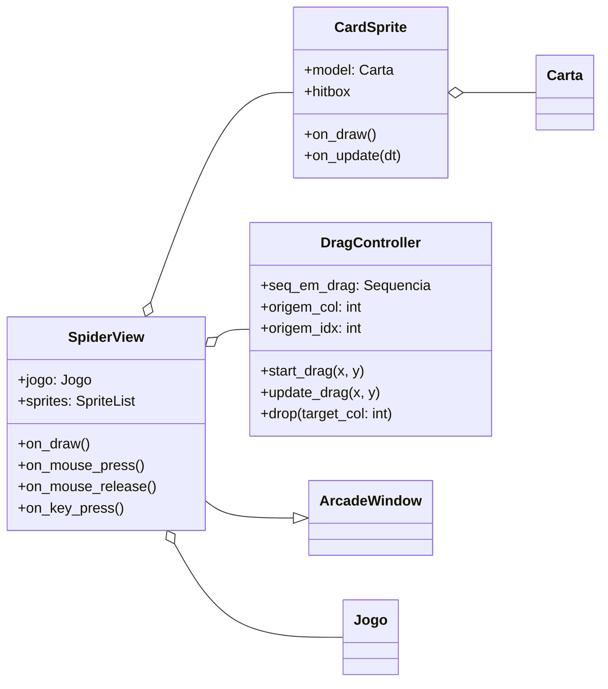

# Paciência Spider 2 Naipes

Projeto Prático da disciplina de Estrutura de Dados 2, Uniube 2025/2

Curso: Inteligência Artificial e Ciência de Dados

Professora: Silvia Brandão

Aluno: Raphael Felix - 5174803

## Definições do projeto

Linguagem utilizada: Python com a biblioteca Arcade.

Objetivo: Desenvolver versões digitais de jogos de cartas da família Paciência, aplicando estruturas de dados
adequadas (pilhas, listas, árvores) e algoritmos de busca/ordenação, de forma a consolidar o aprendizado
prático dos conceitos vistos nas disciplinas de Estruturas de Dados 1 e 2.

Jogo: Paciência Spide 2 Naipes.

Regras do jogo:
- O objetivo é organizar todas as cartas em sequência decrescente do Rei (K) até o Ás (A) no mesmo naipe.
- Quando uma sequência completa é formada (K-Q-J-10-9-8-7-6-5-4-3-2-A), ela é removida do tabuleiro.
- O jogo termina com a vitória quando todas as oito sequências forem removidas.
- São usadas duas baralhos padrão (104 cartas no total).
- Na versão de 2 naipes, usa-se apenas Espadas (♠) e Copas (♥) — cada uma duplicada.
- O tabuleiro tem 10 colunas:
    - As quatro primeiras colunas iniciam com 6 cartas cada.
    - As seis colunas restantes iniciam com 5 cartas cada.
- Somente a carta do topo de cada coluna fica virada para cima, as demais ficam viradas para baixo.
- O restante das cartas (50) forma o estoque (ou “monte”), usado para dar novas cartas durante o jogo.
- Você pode mover a carta de topo de uma coluna para outra coluna se ela for um valor imediatamente menor do que a carta de destino.
- O naipe não precisa ser igual para mover cartas individuais.
- Você pode mover grupos de cartas em sequência decrescente se todas forem do mesmo naipe.
- Qualquer carta (ou sequência) pode ser movida para uma coluna vazia.
- Quando todas as colunas têm pelo menos uma carta, você pode clicar no estoque para distribuir 10 novas cartas — uma em cada coluna.
    - As cartas novas sempre vêm viradas para cima.
    - Não é permitido distribuir novas cartas se alguma coluna estiver vazia.
- Quando uma sequência de 13 cartas (K → A) do mesmo naipe for formada, ela é automaticamente removida do tabuleiro.
- Cada sequência removida aumenta a pontuação e libera espaço.
- Vitória: todas as 104 cartas foram organizadas e removidas.
- Derrota: o jogador não consegue mais fazer movimentos válidos e não há mais cartas no estoque.

### Diagrama UML

---

### Estados e Fluxo Essencial

---

### Diagrama de Sequência

---

### Camada de Visualização

